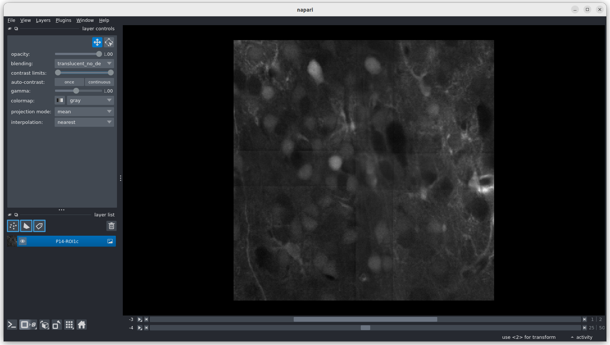
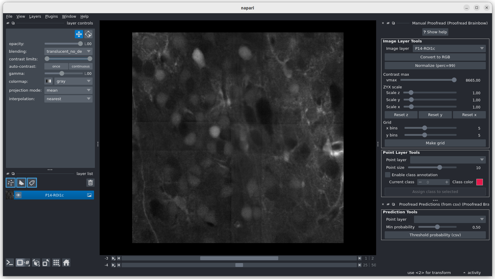
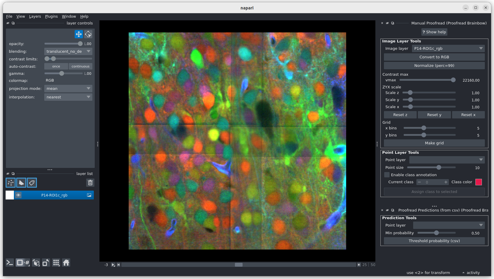
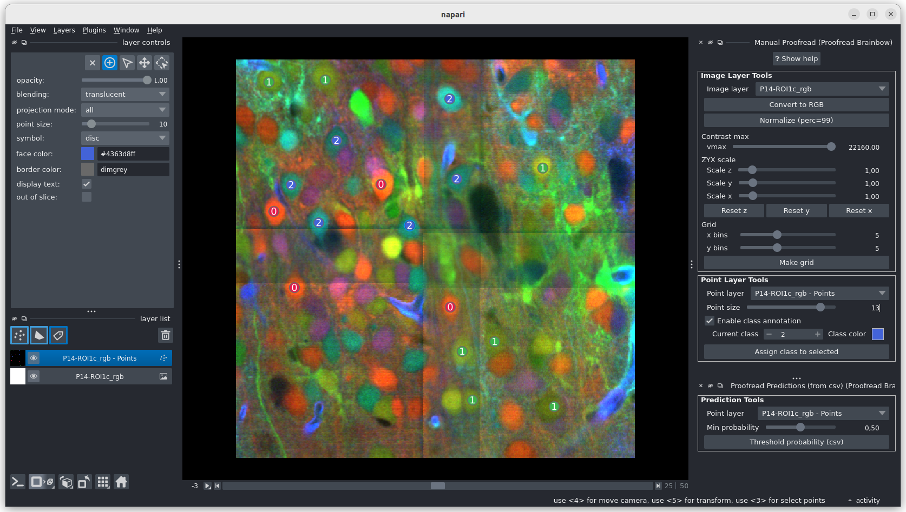
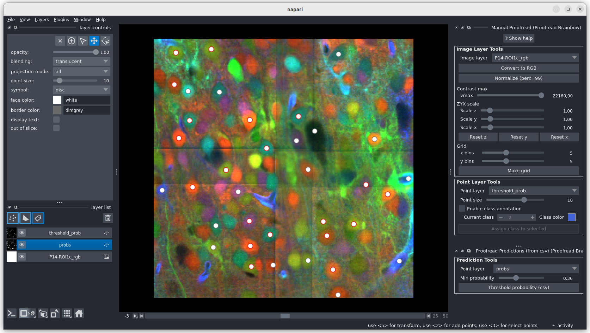
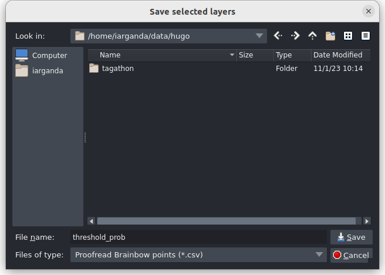

# napari-proofread-brainbow
https://github.com/LaboratoryOpticsBiosciences/napari-proofread-brainbow

[](https://github.com/LaboratoryOpticsBiosciences/napari-proofread-brainbow/raw/main/LICENSE)
[](https://pypi.org/project/napari-proofread-brainbow)
[](https://python.org)
[](https://github.com/LaboratoryOpticsBiosciences/napari-proofread-brainbow/actions)
[](https://codecov.io/gh/LaboratoryOpticsBiosciences/napari-proofread-brainbow)
[](https://napari-hub.org/plugins/napari-proofread-brainbow)
[](https://napari.org/stable/plugins/index.html)
[](https://github.com/copier-org/copier)

Proofreading Brainbow images with napari

----------------------------------

> [!IMPORTANT]
> This repository has been migrated to [LaboratoryOpticsBiosciences/napari-proofread-brainbow](https://github.com/LaboratoryOpticsBiosciences/napari-proofread-brainbow) since v0.3.1.


This [napari] plugin was generated with [copier] using the [napari-plugin-template].

<!--
Don't miss the full getting started guide to set up your new package:
https://github.com/napari/napari-plugin-template#getting-started

and review the napari docs for plugin developers:
https://napari.org/stable/plugins/index.html
-->

## Installation

You can install `napari-proofread-brainbow` via [pip]:

    pip install napari-proofread-brainbow


## Beginner Quick Guide (Step-by-Step)

This plugin provides two panels in napari:

- **Plugins > Proofread Brainbow > Manual Proofread**
- **Plugins > Proofread Brainbow > Proofread Predictions (from csv)**

### 1. Open napari and load your data

1. Start napari:

    ```bash
    napari
    ```
2. Drag and drop your Brainbow image into the viewer (or use **File > Open File(s)...**).
3. If you have prediction points, also load the CSV file.



### 2. Open the plugin widgets

1. Open **Plugins > Proofread Brainbow > Manual Proofread**.
2. (Optional) Open **Plugins > Proofread Brainbow > Proofread Predictions (from csv)** if you want to review model predictions.



### 3. Prepare the image for proofreading

In **Manual Proofread**:

1. Select your image in **Image layer**.
2. Click **Convert to RGB** (for 4D channel-first/channel-middle data).
3. Click **Normalize (perc=99)** to improve visibility.
4. Use **Contrast max** and **ZYX scale** sliders as needed.
5. (Optional) Click **Make grid** to create a labeled grid overlay for systematic review.

Tip: In napari layer list, right-click an RGB layer and use **Split RGB** when needed (often helpful for 3D inspection).



### 4. Add or edit proofreading points

1. Create or select a **Points** layer.
2. In **Point Layer Tools**, set **Point size** for better visibility.
3. (Optional) Enable **Enable class annotation**.
4. Choose a class number and use **Assign class to selected** to label points.



### 5. Review prediction CSV points by confidence (optional)

In **Proofread Predictions (from csv)**:

1. Select the loaded prediction points layer.
2. Adjust **Min probability**.
3. Click **Threshold probability (csv)** to create/update a filtered layer (`threshold_prob`).



### 6. Save your corrected points

1. Select your final points layer.
2. Save as CSV from napari.
3. In the save dialog, set **Files of type** to **Proofread Brainbow points (*.csv)** (as shown in the image). Otherwise, values that should remain integers (for example, class labels) may not be saved correctly.




## Developer Setup

After cloning the repository, you can set up a development environment with conda:

### Step 1: Create and activate the corresponding conda environment

```
conda create -n napari-proofread-brainbow -c conda-forge python=3.11 napari pyqt pytest pytest-qt tox -y
conda activate napari-proofread-brainbow
```

### Step 2: Install requirements with pip

```
cd napari-proofread-brainbow
pip install -e .
```

### Step 3: Test the plugin by running napari

```
napari
```

The plugin should appear under *Plugins > Proofread Brainbow*


## Contributing

Contributions are very welcome. Tests can be run with [tox], please ensure
the coverage at least stays the same before you submit a pull request.

## License

Distributed under the terms of the [MIT] license,
"napari-proofread-brainbow" is free and open source software

## Issues

If you encounter any problems, please [file an issue] along with a detailed description.

[napari]: https://github.com/napari/napari
[copier]: https://copier.readthedocs.io/en/stable/
[@napari]: https://github.com/napari
[MIT]: http://opensource.org/licenses/MIT
[BSD-3]: http://opensource.org/licenses/BSD-3-Clause
[GNU GPL v3.0]: http://www.gnu.org/licenses/gpl-3.0.txt
[GNU LGPL v3.0]: http://www.gnu.org/licenses/lgpl-3.0.txt
[Apache Software License 2.0]: http://www.apache.org/licenses/LICENSE-2.0
[Mozilla Public License 2.0]: https://www.mozilla.org/media/MPL/2.0/index.txt
[napari-plugin-template]: https://github.com/napari/napari-plugin-template

[napari]: https://github.com/napari/napari
[tox]: https://tox.readthedocs.io/en/latest/
[pip]: https://pypi.org/project/pip/
[PyPI]: https://pypi.org/
